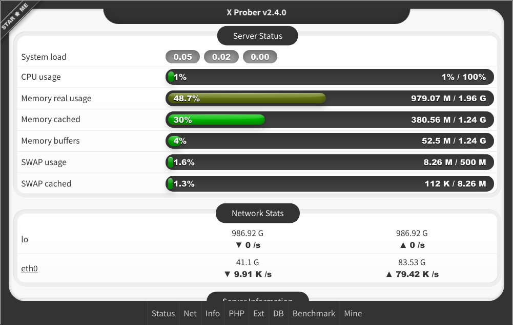

[antergos]: https://antergos.com/distro-logos/logo-square26x26.png 'antergos'
[arch]: https://antergos.com/distro-logos/archlogo26x26.png 'arch'
[fedora]: https://antergos.com/distro-logos/fedora-logo.png 'fedora'
[opensuse]: https://antergos.com/distro-logos/Geeko-button-bling7.png 'openSUSE'
[ubuntu]: https://antergos.com/distro-logos/ubuntu_orange_hex.png 'ubuntu'
[debian]: https://antergos.com/distro-logos/openlogo-nd-25.png 'debian'
[windows]: http://www.likoton.pl/likoton-content/uploads/2013/07/Przycisk-Windows.png 'windows'

- [Simplified Chinese | 简体中文](README-zh_CN.md)
- [Traditional Chinese(Taiwan) | 正體中文（臺灣）](README-zh_TW.md)
- [Traditional Chinese(Hong Kong) | 正體中文（香港）](README-zh_HK.md)
- Japanese | 日本語

# 😎 X Prober

> This is a prober program for **PHP environment**. It can show your server information and readable easily.

And the most important thing is that it's like 📱 **iPhone X/XS/XS Max/XR** !

## License

- GPL-v2

## Online demo

- [https://prober.inn-studio.com](https://prober.inn-studio.com)
- [https://tz.inn-studio.com](https://tz.inn-studio.com) (same)

## Download and Usage

- Click [https://api.inn-studio.com/download?id=xprober](https://api.inn-studio.com/download?id=xprober) to download.
- You will get a single file of `x.php` and upload it to your server.
- Access `x.php` via http browser.

## Required environment

- Compile environment: PHP 7.3+
- Production environment: PHP 5.3+
- Browser support: <del>IE9</del> / Chrome / Firefox / Edge
- OS support: Linux / Windows(basic features)
- Tested: ![debian][debian] ![ubuntu][ubuntu] ![arch][arch] ![windows][windows]

## For development

- Fork.
- Fetch your project.
- Install node modules: `$ npm install`.
- Watch scripts: `$ npm run dev`.
- Generate composer vendor: `$ composer install && composer dumpautoload -o`.
- Compile **development**: `$ php ./Make.php dev`.
- Compile **production**: `$ npm run build && php ./Make.php`.
- Access `./dist/prober.php` from HTTP browser.
- Enjoy it. 😄
- Pull Request.

## Help and translate more languages

- **Fork** project.
- Fetch your project.
- Use [Poedit](https://poedit.net/) to create your language from `./languages/language.pot` language template file and translates it.
- Save your language file _(like: `en_US.po`)_ into `./languages`.
- Pull Request and thank you. 😘

## Note for participate in contribution

- Code compatible with PHP 5.3+

## Contributors

## Backers

Thank you to all our backers! 🙏 [[Become a backer](https://opencollective.com/x-prober#backer)]

## Sponsors

Support this project by becoming a sponsor. Your logo will show up here with a link to your website. [[Become a sponsor](https://opencollective.com/x-prober#sponsor)]

- Thanks [Vultr.com](https://www.vultr.com/?ref=7256513) - 2019-03-13 - \$50

## TODO

- [ ] Temperature sensor.
- [x] More languages with Poedit.
- [x] Detail benchmark result.
- [ ] Add Email send testing.
- [ ] Add network speed testing.
- [x] Add more servers benchmark.
- [x] Add PING feature.

## Keywords

X-Prober/PHP 探针/X 探针/刘海探针
